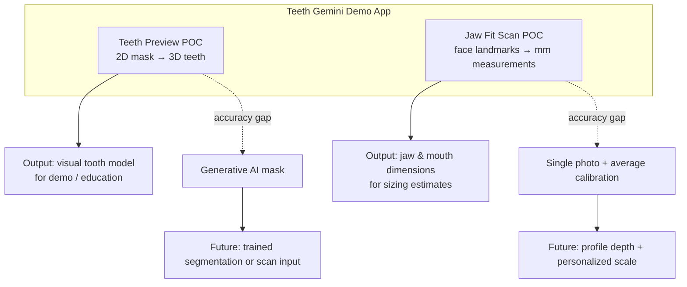
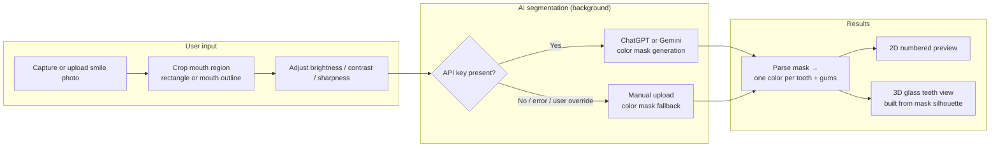
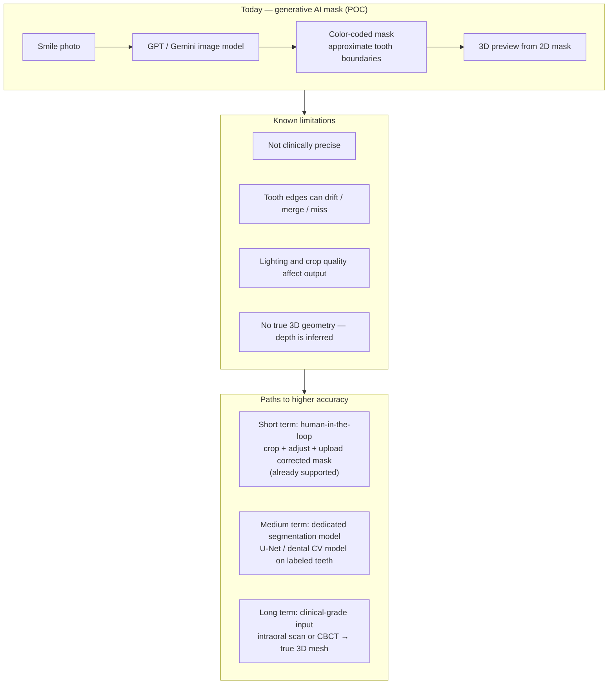
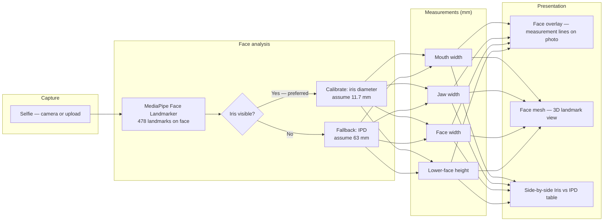
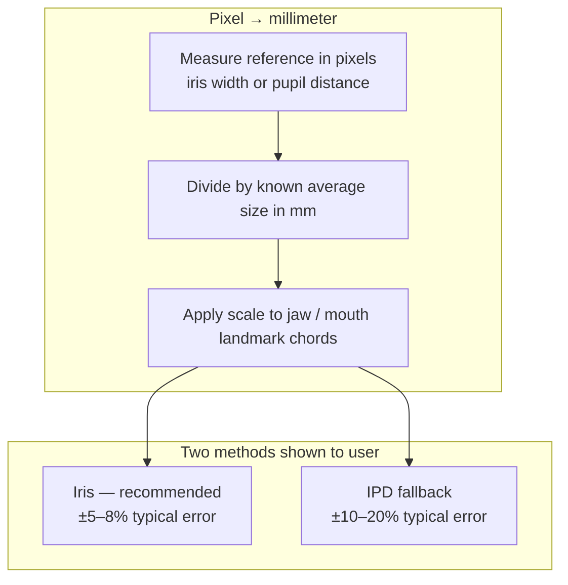
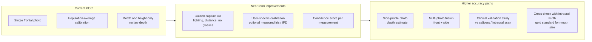

# Teeth Gemini Demo — Pipeline Overview

Living document for tech-PM and engineering stakeholders. Describes what each POC does today, known accuracy limits, and plausible evolution paths.

**App:** `teeth-gemini-demo/`  
**Last updated:** 2026-07-03

---

## Table of contents

1. [App overview](#app-overview)
2. [POC 1 — Teeth Preview](#poc-1--teeth-preview)
3. [POC 2 — Jaw Fit Scan](#poc-2--jaw-fit-scan)
4. [Presentation scripts](#presentation-scripts)

---

## App overview

The demo app hosts two independent proof-of-concepts behind a tab switcher:

| Tab | Purpose | Primary output |
|-----|---------|----------------|
| **Teeth Preview** | AI teeth segmentation → visual 3D model | Numbered 2D mask + glass 3D teeth |
| **Jaw Fit Scan** | Face landmarks → real-world measurements | Mouth/jaw widths in mm (iris + IPD calibration) |

---

## POC 1 — Teeth Preview

### Current pipeline

**Summary:** Photo in → AI (or manual mask) labels each tooth → we turn that 2D map into a numbered preview and a lightweight 3D model.

**Configuration:** Provider (OpenAI / Gemini) is set in `src/constants/demoConfig.ts` — not exposed in the UI. Default: ChatGPT.

**Flow steps in the app:** Capture → Crop → Adjust → Results (segmentation runs automatically on Results).

### Accuracy reality and evolution

Generative image models produce **approximate** tooth boundaries. The 3D view is a **stylized extrusion** from the 2D mask — not clinical geometry.

### Approach comparison (for planning discussions)

| | Generative AI (today) | Dedicated segmentation (concrete next step) | Clinical scan (gold standard) |
|---|---|---|---|
| **Input** | Phone photo | Phone photo | Scanner / CBCT |
| **Accuracy** | Directional / demo | Much tighter boundaries | Clinical |
| **Cost / speed** | Fast, cheap API | Model hosting + training | Hardware + workflow |
| **3D truth** | Stylized from 2D | Still mostly 2D→3D | Real 3D |

### Key code references

| Area | Path |
|------|------|
| Demo wizard | `teeth-gemini-demo/src/pages/GeminiTeethDemoPage.tsx` |
| Auto-segment hook | `teeth-gemini-demo/src/hooks/useDemoAutoSegment.ts` |
| Unified API | `src/api/teethSegmentation.ts` |
| Mask parsing + numbered 2D | `src/pages/TeethModeling/utils/colorMaskSeparation.ts` |
| 3D scene | `src/features/geminiTeeth/useTeethGemini3DScene.ts` |
| Mask → 3D geometry | `src/pages/TeethModeling/rendering/geminiMaskTo3D.ts` |

---

## POC 2 — Jaw Fit Scan

### Current pipeline

**Summary:** Selfie → MediaPipe finds face points → we scale pixels to mm using the eye as a ruler → show mouth/jaw widths with clear accuracy caveats.

**Flow in the app:** Capture → Results (MediaPipe pre-loads when the tab opens).

### Pixel → millimeter calibration

**Landmarks used (MediaPipe indices):**

| Measurement | Landmarks | Use |
|-------------|-----------|-----|
| Mouth width | 61 → 291 | Primary sizing input |
| Jaw width (bigonial) | 172 → 397 | Handle-length proxy |
| Face width (bizygomatic) | 234 → 454 | Scale cross-check |
| Lower-face height | 152 → 1 | Vertical reference |

**Why iris is preferred over IPD:** Lower population variance (±3.4% vs ±11%+), less sensitive to head tilt, and closer to the jaw region in the image (similar lens distortion profile).

### Accuracy notes (shown in UI)

- **Calibration:** ±5–8% (iris) or ±10–20% (IPD fallback)
- **Landmark placement:** ±2–4% on well-lit, face-parallel photos
- **Jaw depth:** Not available from a single frontal photo
- **Not clinical:** Directional estimates only — CBCT or intraoral scan required for dental planning

### Future improvements

### Key code references

| Area | Path |
|------|------|
| Demo page | `teeth-gemini-demo/src/pages/JawFitScanPage.tsx` |
| Face scan hook | `teeth-gemini-demo/src/hooks/useFaceScan.ts` |
| Measurements + calibration | `teeth-gemini-demo/src/utils/jawMeasurements.ts` |
| Constants + accuracy notes | `teeth-gemini-demo/src/constants/demoConfig.ts` |
| MediaPipe (shared) | `src/pages/DentalSimulation/faceLandmarker.ts` |

---

## Presentation scripts

### Teeth Preview (~30 seconds)

> We take a smile photo, optionally crop and tune it, then either ChatGPT/Gemini or a human-uploaded mask colors each tooth. That mask drives a 2D numbered view and a lightweight 3D preview. It's fast and good for demos, but boundaries are approximate — the product path is either better segmentation models or clinical 3D input.

### Jaw Fit Scan (~30 seconds)

> We take a frontal selfie, MediaPipe finds facial landmarks, and we convert pixel distances to millimeters using the iris as a ruler (IPD as backup). We show both calibrations so stakeholders see the uncertainty. Depth isn't available from one front photo — that's a clear future item (side view or scan).

---

## Maintaining this document

Update this file when:

- Pipeline steps or tabs change in the demo app
- A new segmentation provider or calibration method is added
- Accuracy claims or landmark indices change
- A planned improvement moves from "future" to "shipped"

Related user-facing copy: `teeth-gemini-demo/README.md` (setup and run instructions only).
